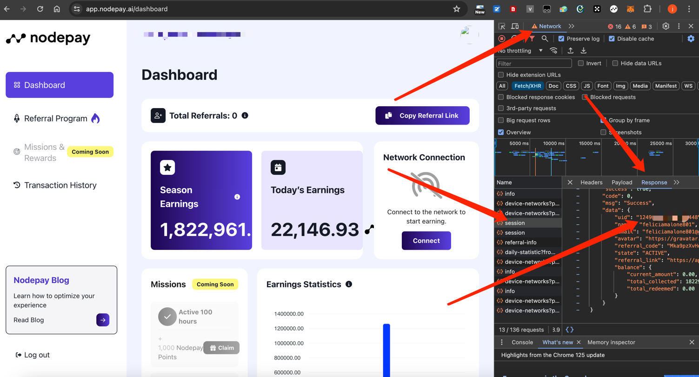

# NodePay
> A tool for earning points based on the nodeapy extended protocol.

## [Telegram Group ✈️](https://t.me/+iergzCgtkw9iZWFl)
> You can communicate via telegram.

## Use 🚗
> copy nodepay bin file cookies.txt proxy.txt config.yml files to your server

### Cookie Fetch
> If you find cookie extraction troublesome you can try our paid service, please contact us on telegram.

#### 1、Login your nodepay account
#### 2、Preparing to extract cookies and uid



#### 3、Copy cookie and uid to cookies.txt
#### 4、Read config.yml to select configuration items


### 1、Linux
``` bash
chmod 755 nodepay
./nodepay
```


### 2、Windows
> dclick nodepay.exe file

